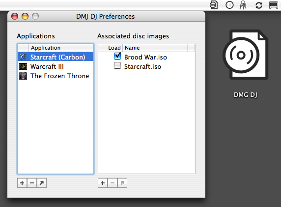

# DMG DJ

Disc image manager. Mounts necessary images when you launch an app, unmounts them when you quit.

This was originally developed to play Blizzard's Starcraft, Brood War, and Warcraft III
single-player campaigns from disc images, long before Blizzard released official no-CD patches,
but should work for other applications as well.

## Requirements

Mac OS X 10.4+. Built as a universal binary.

## Usage

Open the app. Drag applications you want to manage into the "Applications" list on the left.
Drag disc images for those applications into the "Associated disc images" list on the right.
Click the "Load" checkbox to make a given app load a given image. The arrow buttons under each list
should reveal the selected app or disc image in the Finder.

## Notes

I wrote this in 2007 and have resurrected it onto Github for historical interest only.
Not sure if it'll even still compile with modern versions of Xcode, but fortunately, I do have
an old build as well as the source. Check the Releases tab.

Thanks to [@nathanday](https://github.com/nathanday) for `NDResourceFork`.
